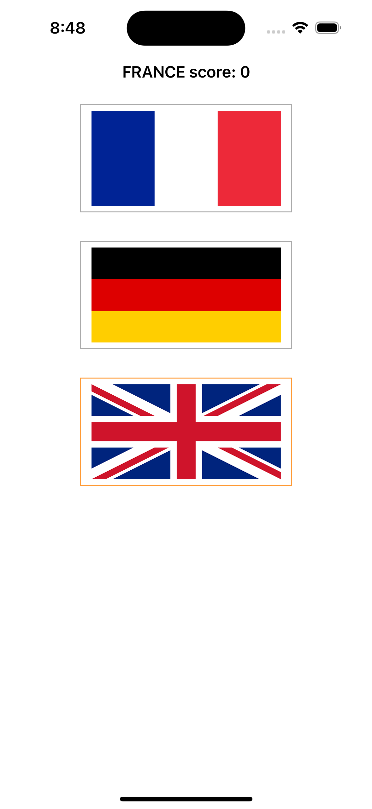
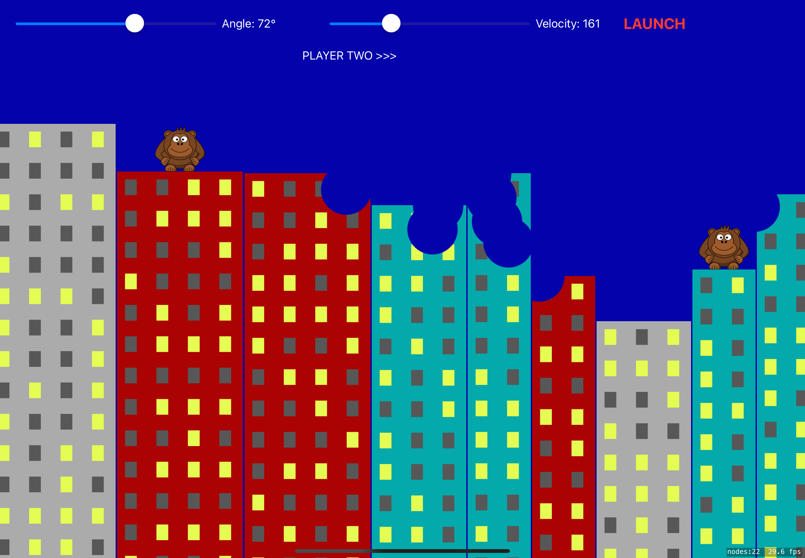

# hws-100-days-of-swift-uikit
Completed projects for Paul Hudson's "100 days of Swift" course. UIKit branch. https://www.hackingwithswift.com/100

#Preview
| Project | Screenshot |
| :------ | :--------- |
| Project 1 - Storm Viewer FileManager |  |
| Project 2 - Guess the Flag IBAction, CALayer |  |
| Project 3 - Social Media UIActivityViewController |  |
| Project 4 - Easy Browser WKWebView |  |
| Project 5 - Word Scramble UIAlertController |  |
| Project 6 - Auto Layout Auto Layout, Visual Formatting Language |  |
| Project 7 - Whitehouse Petitions Codable |  |
| Project 8 - Swift Words UI |  |
| Project 9 - Grand Central Dispatch Grand Central Dispatch, PerformSelector |  |
| Project 10 - Names to Faces UIImagePickerController, NSObject |  |
| Project 11 - Pachinko SpriteKit, Physics engine, SKAction, SKMEmitterNode |  |
| Project 12 - User Defaults UserDefaults, NSCoding, Codable |  |
| Project 13 - Instafilter CIContext, CIFilter, Persistant data |  |
| Project 14 - Whack-a-Penguin SKCropNode, SKTexture, SKAction |  |
| Project 15 - Animation Animation, CGAffineTransform |  |
| Project 16 - Capital Cities MapKit, MKAnnotation |  |
| Project 17 - Space Race Collision, Timer, Damping |  |
| Project 18 - Debugging Debugging techniques | No screenshot |
| Project 19 - Javascript Injection Safari Extensions, NSExtensionItem, NotificationCenter |  |
| Project 20 - Fireworks NightUIKit Dynamics, UIBezierPath |  |
| Project 21 - Local Notifications Notifications, UNUserNotificationCenter, UNNotifcationRequest |  |
| Project 22 - Detect-a-Beacon iBeacon, Core Location |  |
| Project 23 - Swifty Ninja AVAudioPayer, CGPath, UIBezierPath |  |
| Project 24 - Swift Strings NSAttributedString | No screenshot |
| Project 25 - Selfie Share Multipeer connectivity, MCSession, MCBrowserViewController |  |
| Project 26 - Marble Maze Accelerometer, CMMotionManager, Bitmasks |  |
| Project 27 - Core Graphics Core Graphics, UIGraphicsImageRenderer, Transforms |  |
| Project 28 - Secret Swift Biometrics authentication, Touch ID, Face ID, iOS Keychain |  |
| Project 29 - Exploding Monkeys SpriteKit+UIKit, Texture atlas |  |
| Project 30 - Instruments Debugging, Performance, Instruments, Time Profiler, Allocations |  |
